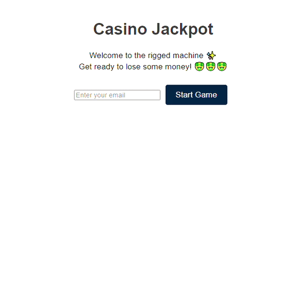

# Rigged Casino Machine

## About

This is a rigged casino machine implemented using the MERN stack.

I decided to go with the MERN stack (MongoDB, Express framework, React, and NodeJS) since I recently started learning and working with it as part of the [Fullstack Open](https://fullstackopen.com/en/about/) course offered by the University of Helsinki. This is a great opportunity to practice what I have learned so far.

I will be dividing the project into two main directories: `client` and `server`.

## Development Process

### 1. **COMMIT 86ab8b8**

Created a basic client and server that communicate with each other. For now, all they pass is the number of credits the player has.

- **Server**: I chose Express because it simplifies error handling and provides a better abstraction that enhances code readability.
- **Client**: I chose the Axios library for communication for same reasons I chose Express.

### 2. **COMMIT 721730a**

Finished making the basic functionality of the client. It can now roll the slots randomly (for now, it is still fair...), added buttons for starting the game, rolling, cashing out, and buying more credits. Some of the buttons do nothing besides printing to the console but will be communicating with the backend later. Applied minimalistic CSS to make it somewhat presentable.

- I decided to use updater functions wherever a value with state was modified. I find it more readable and easy to debug.

**TODO in client:**

- Adjust functions to work with the server, move the generation of the results of fruits to the server, add logging of cashouts and losses to the server, etc.
- Refactor code to smaller components and separate files.

### 3. **COMMIT 8ce9037**

Finished server-side logic and transferred the generation of the roll results there.

Since it wasn't specified in the task how to treat users, I chose to keep track of users by their email, which will be used as a unique key. For simplicity, I did not use UUID as an identifier and didn't apply any authentication methods. The client can now log in/register with their email (not checking for validity of the email string, so it can also be some random characters... imlemented [this solution](https://stackoverflow.com/questions/73568206/email-validation-is-not-working-in-javascript]) later on). Users can play the rigged slot machine, cash out, buy more credits once they reach 0, and return to their session with login while maintaining the same number of credits.

The data is saved on the server side as an array of objects containing the email of the user and the number of credits they have at the moment.

The problem with the current approach is that all of the data is stored in memory on the server in an array. If the server disconnects for some reason, we will lose all our data. The next step would be to move it all into a database. I'll probably stick with MongoDB since we currently have very simple data to store and don't need any relational database schema.

Also, need to add animations to the client and apply small design finishes.

### 4. **COMMIT ea1285c**

Created a MongoDB server where all users are stored, keeping it simple for this task by saving only the email and number of credits each user has (MongoDB by default also generated a UUID in the object).
On user registration, server inserts user data into MongoDB, for actions like rolling slots or cashing out, the server updates and retrieves user data from MongoDB.
I decided to keep the data field stored in database fairly minimal which I find fit for the scope of this task, but they could be extended in the future to have more helpful data.

### 5. **COMMIT b42d33c**

Refactored the server code into smaller services: server, routes, controllers, and db, as suggested in [Node.js project architecture best practices](https://blog.logrocket.com/node-js-project-architecture-best-practices/).

Refactored the client into smaller components, using the React Refactor extension for VSCode to make it quicker.

The application is now basically fully functioning and working. Needs testing.

### 6. **COMMIT dc4f34a**

This was my first experience with app testing. I chose Jest for this purpose since it is good for both Nodejs and React and followed the guidelines provided in [Full Stack Open's Part 4](https://fullstackopen.com/en/part4) as well as several YouTube tutorials. I generated the test files with [ChatGPT](https://chatgpt.com/) for testing of different scenarios. Still don't feel 100% comfortable with working with Jest and not fully familiar with the syntax for the testing files.

TODO: add client tests

### API Endpoints

- `POST /api/register`: Registers a user and returns initial credit balance.
- `POST /api/cashout`: Processes cash-out request and returns updated credit balance.
- `POST /api/buy`: Allows user to buy credits and returns updated credit balance.
- `POST /api/roll`: Rolls slots and returns new slot values and winnings.

### Some other considerations

- The application currently lacks security protocols. There is a risk of impersonation as it does not implement authentication or email validation. For future development and scaling, integrating these security measures is a must.
- I decided to allow users to register with their emails and come back to the game if they left the session.
- When a user cashes out, their credits are reset to 0 in the database. Upon returning, registered usersand new players will start with 10 credits.
